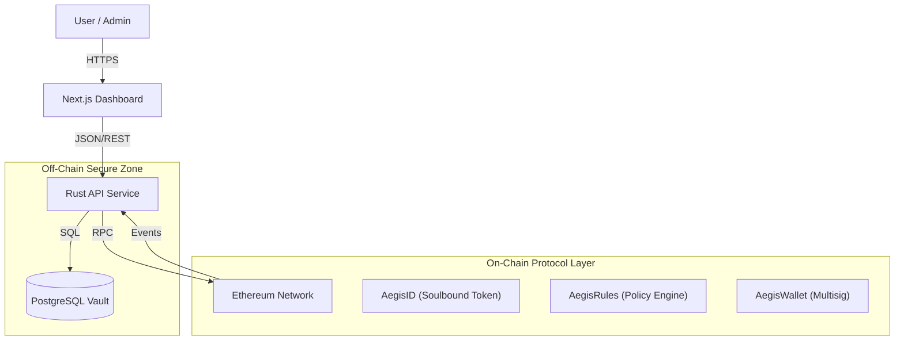

# Aegis Fintech V1

> **Status:** Pilot Ready / Reference Implementation
>
> **Description:** Next-Generation Compliance Infrastructure for Decentralized Finance (DeFi)

   

---

## Executive Summary

**Aegis Fintech V1** is a compliant financial infrastructure layer designed to bridge traditional banking standards with permissionless blockchain networks. 

The primary challenge in institutional DeFi is ensuring strict adherence to **Know-Your-Customer (KYC)** and **Anti-Money Laundering (AML)** regulations without compromising the efficiency of smart contracts. Aegis addresses this by introducing a **Soulbound Token (SBT)** architecture where legal identity verification is performed off-chain, and a non-transferable identity token is issued on-chain. This enables smart contracts to enforce regulatory compliance programmatically at the transaction level.

### Key Capabilities
*   **Identity Verification:** Automated onboarding of verified legal entities via Soulbound Tokens.
*   **Regulatory Guardrails:** Hybrid rule engine enforcing compliance both on-chain (smart contracts) and off-chain (API).
*   **Bank-Grade Security:** High-performance Rust backend leveraging strict type safety and memory security.
*   **Institutional Dashboard:** A responsive, professional interface for treasury management and compliance oversight.

---

## System Architecture

Aegis implements a **Web 2.5** hybrid architecture. Sensitive Personally Identifiable Information (PII) is isolated in a secure off-chain vault, while cryptographic proofs of identity are utilized on the public blockchain.



### Security Model
1.  **Data Sovereignty:** PII is never stored on-chain. Only opaque identity hashes and status flags are committed to the ledger.
2.  **Role-Based Access Control (RBAC):** The system uses a granular permission model.
    *   **Admin:** Can upgrade contracts and update global policy.
    *   **Compliance Officer:** Can revoke identity tokens or flag suspicious wallets.
    *   **Agent:** Can execute treasury transactions within defined daily limits.
3.  **Circuit Breakers:** The `AegisRules` contract acts as an on-chain firewall, automatically rejecting transactions that exceed daily volume limits or originate from unverified addresses.

---

## Technical Stack

### Infrastructure Layer (Backend)
*   **Language:** Rust (Edition 2021)
*   **Server Framework:** Axum 0.7 (Tokio Runtime)
*   **Persistence:** PostgreSQL with SQLx 0.7 (Compile-time checked queries)
*   **Blockchain Integration:** Ethers.rs 2.0
*   **Authentication:** Argon2 hashing for credentials, JWT for session management.

### Interface Layer (Frontend)
*   **Framework:** Next.js 16 (React Server Components)
*   **Language:** TypeScript
*   **Styling:** Tailwind CSS v4
*   **State Management:** Server Actions + React Hooks

### Protocol Layer (Smart Contracts)
*   **Language:** Solidity 0.8+
*   **Framework:** Hardhat
*   **Standards:** ERC-721 (Modified for Soulbound properties), AccessControl

---

## Getting Started

 For a comprehensive deployment guide, please refer to [QUICKSTART.md](QUICKSTART.md).

### Prerequisites
*   Docker Desktop (Active)
*   Node.js 18+
*   Git

### 1. Initialize Local Blockchain
Start a local Ethereum node to simulate the blockchain environment.
```powershell
npx hardhat node
```

### 2. Deploy Infrastructure
In a separate terminal, deploy the smart contracts and start the application stack.
```powershell
# Deploy Smart Contracts to Localhost
npx hardhat run scripts/deploy.js --network localhost

# Start Backend API, Database, and Frontend
docker-compose up --build
```

### 3. Verification
Access the services at the following endpoints:
*   **Frontend Dashboard:** [http://localhost:3001](http://localhost:3001)
*   **Backend API:** [http://localhost:8080](http://localhost:8080)

**Default Credentials:**
*   **Username:** `admin`
*   **Password:** `password123`

---

## Project Structure

```bash
AEGIS_FINTECH_V1/
├── contracts/          # Solidity Smart Contracts (Identity, Access, Governance)
├── dashboard/          # Next.js Frontend Application
├── scripts/            # Deployment & Maintenance Scripts
├── src/                # Rust Backend Application Code
├── GUIDES/             # Documentation & Guides
├── docker-compose.yml  # Container Orchestration Configuration
├── Cargo.toml          # Rust Dependency Manifest
└── hardhat.config.js   # Blockchain Development Configuration
```

---

## Disclaimer
This codebase is provided as a **Reference Implementation** for educational and research purposes. While it utilizes production-grade technologies, it has not undergone a formal third-party security audit. Do not use in production environments with real assets without a comprehensive security review.

---

## License
Distributed under the MIT License. See `LICENSE` for details.
